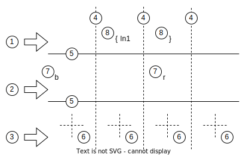
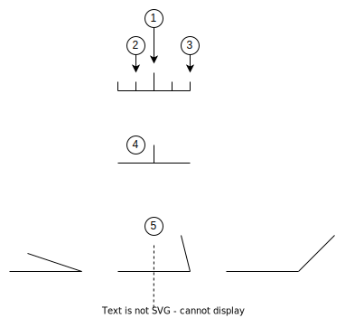
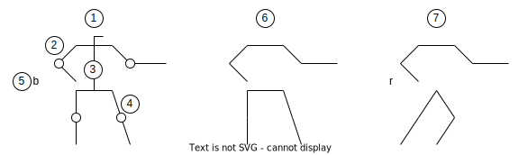
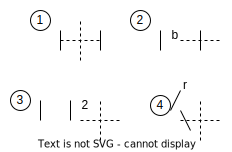

# 舞蹈姿势表达符号集 [Dance Posture Notation Set]
本文档描述了一组用来描述舞蹈姿势的符号的集合以及它们的组织方式(以下简称“符号集”)。设计这份符号集的初衷是为了解决部分作者在学习舞蹈的过程中遇到的种种问题，比如忘记的快，对于舞蹈循环次数预测能力较弱等。同时在本符号集设的过程中，引申出了其他潜在的用途，比如方便描述新编舞蹈动作，和方便课后复习所学舞蹈动作等。

## 设计原则
本符号集的设计原则如下：

- 容易理解，学习成本低，难度不能高于学习乐谱。
- 方便快速谱写。符号表达不追求涵盖绝大多数的细节，重点在于姿态表达的要点。
- 以时间线为横轴，以方便与乐谱等进行联合表达。

## 设计正文
以下为设计的正文部分。

### 底版
符号集底版如图所示：

底版中的元素说明：

1. 顶部俯视图表示区。
2. 身体姿视图表示区。
3. 步伐图表示区。
4. 节拍间隔线。
5. 表示区分割线
6. 步伐中心点位置（十字交点处）。
7. 身体姿势图视线方向符号。"b"表示从后方观察。"r"表示从右侧观察。后续序列视线方向不变的情况下，符号可省略。
8. 编组符号。将**当前视图表示区的序列**编组并赋予名字(这里的示例名称为："ln1")，以方便在后续的序列中引用。这样可以避免重复的符号绘制动作。当引用的时候只需要使用"{名称}"即可。

本图例中展示了绝大多数需要用到的元素。遵从便于谱写的设计原则，在图例**能被读者理解**的情况下，元素遵循**能省就省**的原则。最简单的情况下，可能只有一条视图表示区内的内容，分界线和时间轴可以全部省去。

### 顶部俯视图
顶部俯视图的作用为上半身所面对的方向，和四肢在平面上的位置。

说明：

1. 中心竖线表示上半身面对的方向。
2. 边缘和中心之间的竖线表示腿的方向在顶部平面上的**投影**，各自对应左右腿。
3. 边缘竖线表示手臂的方向在顶部平面上的**投影**，各自对应左右手臂。
4. 在只关心上半身朝向而不关心四肢的方向的情况下，可以仅保留表示方向的线条。
5. 顶部俯视图亦可表示两个姿势之间过度动作的说明。在这种情况下，符号可放置于节拍间隔线上。

依然根据简约的设计原则，假如在后续的过程中不重视方向和四肢的表达，可省略顶部视图符号。假如后续一段节拍内不重视方向和四肢的表达，或者延续之前最后一个符号表达的信息，可以在节拍内跳过符号绘制。

### 身体姿势视图
身体姿势视图样例如下：

说明：

1. 表示脸部朝向。注意与顶部视图的方向不是一个概念。
2. 手臂姿势表示。想要突出表示手臂的弯折处，可以使用加圆圈的方法表示。
3. 腰杆。
4. 腿部。与手臂类似，如需表示膝部，可使用圆圈。
5. 视角表示。目前支持后背视图('b':Backview)，右侧视图('r':Rightview)和左侧视图('l':Leftview)。
6. 在不强调某些部位细节的情况下，这些部位可以省略。如本例子所示。
7. 第一个视图符号需使用视角表示来表明所用的视角。后续符号未改变视角的情况下，可省略视角符号。假如出现视角变换，则需要重新绘制视角符号。

### 步伐视图

步伐视图如下：

说明：

1. 中心点位于两脚之间。左右各有一竖条表示两只脚。
2. 脚步移动之后，使用左右脚距离与中心点的关系知晓左右脚的位置。通常情况下，可以根据图示预估两脚之间的距离。假若要特别强调距离，可以使用数字表示两脚之间的距离，单位为脚长。比如1为一脚长。另可以通过特定字母表示间距。比如'b'代表一大步(Big Step)。当前版本'b'为唯一支持的字母。
3. 当舞步相对于初始位置发生移动的时候，亦可通过图例表示。可以在脚与中点之间用数字表示距离，单位依然是步数。数字可以是小数。
4. 由于有些动作人类无法做出，所以没有在描述脚的符号上定义方向。假如发生脚交错的情况，则可以在其中一只脚上标注l(eft)或者r(ight)表示左右脚。

### 过渡描述

在两个动作之间，可能有一些特定的描述用以表达过渡过程。这个过渡过程可以通过文字来进行提示，谱作者也可以通过详细的绘画的形式进行描述。本文档不应用严格的要求，以便让读者有发挥的空间。

示例：

### 描述子集

在动作快的场合，可能会使得拍子间的间隔不足以绘制符号。这种情况下，可以为快节奏的拍子绘制单独的图谱，然后使用一个集合名代表这个子集合。

